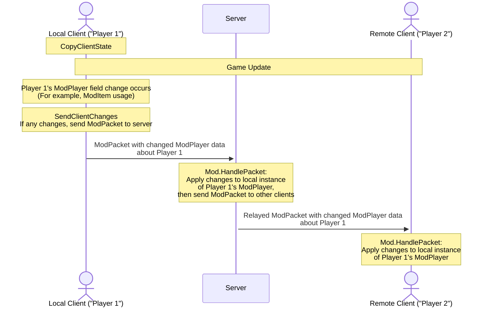

> 本文内容整理自 tModLoader 官方 Wiki（Terraria 模组开发指南），原文：[Basic Netcode Guide](https://github.com/tModLoader/tModLoader/wiki/Basic-Netcode)。

想自己动手收发 `ModPacket`？那得看[中级联机同步指南](https://github.com/tModLoader/tModLoader/wiki/Intermediate-netcode)。这篇只解决一件事：怎么让模组在多人游戏里别出岔子。

# 入门

Terraria 联机是常态，多人兼容不该等到模组做完才想起来补。开发过程中就早点、经常地在多人环境里测试。下面讲讲怎么让自己的模组在多人下正常工作 —— 说实话，没有想象中那么难。

# 核心概念

搞懂 Terraria 联机，先记住三件事：

1. 你运行的这个游戏程序本身，叫做"客户端"（Client）。
2. 联机时，你的客户端和其它玩家的客户端都连到一台"服务端"（Server）上。
3. 连上服务端之后，这些客户端要通过服务端互相通信，游戏里发生的事情才能在所有客户端之间保持同步。

说白了就是：靠网络包（packet）在客户端之间传递，让所有玩家的游戏状态保持一致。这在联机里时时刻刻都在发生，原版也不例外。**客户端不能直接收发另一个客户端的东西 —— 必须由服务端当中间人。**

# 测试联机兼容性

开个服务器让别人进来玩，就是最直接的测试方式。模组会自动从你的电脑同步给他们，哪怕你没在 `build.txt` 里升版本号也一样。也就是说，测试阶段不需要每次都发布到创意工坊，模组直接从服务端发过去。

## 在本机测试多人游戏

想一个人测，就在电脑上开两个 tModLoader 客户端。Steam 平时只允许启动一次，但手动再开一份它是拦不住的：打开 tModLoader 的[安装目录](https://github.com/tModLoader/tModLoader/wiki/Basic-tModLoader-Usage-Guide#install)，双击 `start-tModLoader.bat`（非 Windows 用户是 `.sh`），第二个客户端就起来了。记得切成窗口模式，全屏不好切来切去。然后让第一个客户端"host and play"，第二个客户端用"join via IP"，IP 填 `localhost`。

要调试跑在服务端上的代码，得用[启动调试器](https://github.com/tModLoader/tModLoader/wiki/Learn-How-To-Debug#launching-the-debugger)的办法，但启动目标选 "Terraria Server" 而不是 "Terraria"；这样启动之后，你需要手动开两个客户端，通过 `localhost` 连上去。

注意：开两个客户端时，游戏窗口不在前台的那一份刷新频率会降低，有些看起来像 bug 的现象其实是这个原因，不用当真。

# 自动同步（非 ModPacket）

很多同步工作 Terraria 已经替我们做了，我们只要用对就行。

## NPC / ModNPC

NPC 身上任何"不确定"的决定都必须同步给客户端 —— 服务端是所有 NPC 的归属方。就像 [ExampleCustomAISlimeNPC.cs](https://github.com/tModLoader/tModLoader/blob/stable/ExampleMod/Content/NPCs/ExampleCustomAISlimeNPC.cs#L222) 里那样，用 `npc.netUpdate` 触发 NPC 的同步逻辑：只要它被设为 `true`，Terraria 就会把服务端的坐标、生命值等数据同步到客户端。如果有些额外数据是所有客户端都要用的，别急着上 `ModPacket`，用 [ModNPC.SendExtraAI](https://docs.tmodloader.net/docs/stable/class_mod_n_p_c.html#ab97269b1204781b8cbf396c31e604154) 和 [ModNPC.ReceiveExtraAI](https://docs.tmodloader.net/docs/stable/class_mod_n_p_c.html#abb7c4468cbdba533146c4e35f3299a69) 就行 —— 这些数据会跟着 npc 本身的同步一起发出去。

不同步导致失步（desync）的视频示例
<blockquote>

`ExampleCustomAISlimeNPC.cs` 里提到过，非确定性决定必须同步。下面这段视频演示的就是 AI 代码里随机选择的值没同步好会出什么问题 —— 注意两个客户端上的史莱姆都会在 NPC 周期性同步时，瞬移到服务端发来的正确位置：

https://github.com/user-attachments/assets/27b289c0-37a6-47e8-9e35-ea6f641612f0

这是修好之后、没有失步问题的表现：

https://github.com/user-attachments/assets/f2bdcea4-8fe6-4eba-aa0d-0d36ade9a16d

</blockquote>

## Projectile / ModProjectile

弹幕的规则和 NPC 一样，区别在于归属方不一定是服务端：玩家打出来的弹幕归那个玩家（客户端）所有，其它像 NPC 生成、世界生成的弹幕则归服务端。当客户端上的数据变了，`projectile.netUpdate` 标志会把客户端的数据同步给服务端，服务端再转发给其它客户端。[Magic Missile](https://terraria.wiki.gg/wiki/Magic_Missile) 就是现成的例子：AI 里先判断 `if (Main.myPlayer == projectile.owner)`，如果位置因为玩家的鼠标位置变了，就设 `projectile.netUpdate = true;`。

## World / ModSystem

世界数据只应该在服务端改动。世界上发生任何要紧事 —— 服务端控制台敲个 Noon 命令、Boss 被打死、随机入侵触发 —— 世界数据都会从服务端同步到客户端。而每次世界数据同步时，每个 `ModSystem` 也会通过 [NetSend](https://docs.tmodloader.net/docs/stable/class_mod_system.html#af9ebfea8b152b555b030265946cace70) 和 [NetReceive](https://docs.tmodloader.net/docs/stable/class_mod_system.html#a144ef598fa0b3bcc2a0ac6bd1c5467aa) 跟着同步。想在服务端主动触发一次世界数据同步，调用 `NetMessage.SendData(MessageID.WorldData);` 即可，[Abomination](https://github.com/tModLoader/tModLoader/blob/stable/ExampleMod/Old/NPCs/Abomination/CaptiveElement2.cs#L368) 里设置 `ExampleWorld.downedAbomination = true;` 时就是这么干的。不过尽量只在必要的时候用。

## Item / ModItem / GlobalItem

物品同样会同步，用 [`NetSend`](https://docs.tmodloader.net/docs/stable/class_mod_item.html#a80e9898e70b923e0a2a9b0d643504e8e) 和 [`NetRecieve`](https://docs.tmodloader.net/docs/stable/class_mod_item.html#a3d30fa657a2319543bdd619d2ad32f81) 来同步数据。如果要做些非常规的操作，去看反编译源码；大多数模组根本不需要手动触发同步。注意，物品同步时只会带走很小一部分字段，所以像在 `UpdateInventory` 里改 `Item.damage` 这种默认值的做法并不可取 —— 那种需求请用 [`ModifyWeaponDamage`](https://docs.tmodloader.net/docs/stable/class_mod_item.html#a1f23f4899b8fd233d4cbfc7698bb34ba)。

物品在大多数相关场景下会自动同步，比如被丢在地上或转移时。有一种情况要特别留心：物品待在玩家背包里，但它的变化会影响玩家的行为、或者影响它自己被使用时的表现。不处理同步的话，别的客户端看到的这个物品表现可能就不一样。这种时候调一下 `Item.NetStateChanged();` 就能触发这个背包/装备栏物品重新同步，[UseStyleShowcase.cs](https://github.com/tModLoader/tModLoader/blob/stable/ExampleMod/Content/Items/UseStyleShowcase.cs) 就是实际用例：本地代码改变了物品的行为，于是代码顺手把改动同步出去，保证各客户端看到的表现一致。

## ModTileEntity

归服务端所有。客户端第一次进入它所在的"区块"（chunk / section）时，服务端把它发过去。改动在服务端进行，再由服务端同步给客户端。`ModTileEntity` 的代码可以发一条 `MessageID.TileEntitySharing` 消息手动触发同步，这会把它当前的各个值发给所有客户端，让数据保持一致。例子见 [BasicTileEntity](https://github.com/tModLoader/tModLoader/blob/1.4.4/ExampleMod/Content/TileEntities/BasicTileEntity.cs#L66) —— 注意 `WaterFillLevel` 的 setter 就会发送 `MessageID.TileEntitySharing`，让客户端跟上。

## Player / ModPlayer

玩家数据量非常大，所以同步用了专门的机制，目的就是尽量减少同步的频率和范围。`SyncPlayer`、`CopyClientState`、`SendClientChanges` 这几个方法的用途和用法，看 [ModPlayer 文档](https://docs.tmodloader.net/docs/stable/class_mod_player.html)和 [ExampleStatIncreasePlayer](https://github.com/tModLoader/tModLoader/blob/stable/ExampleMod/Common/Players/ExampleStatIncreasePlayer.cs) 就能明白。原版 `Player` 的数据 —— 背包格、生命值、坐标、选中的物品 —— 都会自动同步，所以改这些值会自动传到服务端并转发给其它客户端。饰品的加成效果在每个客户端上都会各自计算一遍，所以饰品效果本身也不用同步。生物群系标记（biome flag）同样会自动同步。但 `SyncPlayer` 和 `SendClientChanges` 没用好就会失步，还会带出一堆别的问题，这两个非常关键，必须写对。

### CopyClientState 与 SendClientChanges

`CopyClientState` 和 `SendClientChanges` 负责让服务端与其它客户端跟得上本地客户端的改动。如果有 `ModPlayer` 数据是服务端和远程客户端跑游戏逻辑时必须知道的，那它就必须同步。下面这张图展示了两者怎么配合。

先由 `CopyClientState` 给 `ModPlayer` 的数据拍一张快照。接着游戏继续跑这一帧的其余更新流程，这期间可能发生物品使用、UI 交互等一大堆事，`ModPlayer` 的数据可能就被改了。之后调用 `SendClientChanges`，拿刚才那张快照和当前的 `ModPlayer` 值做对比，一旦发现变化，模组就构造一个 `ModPacket`，把变化的数据发给服务端。服务端收到后，把这些数据套用到它本地那份该玩家的 `ModPlayer` 上，再用一个新的 `ModPacket` 转发给其它所有客户端。其它客户端收到后，同样把数据套用到本地那份该玩家的 `ModPlayer` 上。

# 多人环境下的钩子

各种"钩子"（hook）在哪里执行，心里得有数。有些只在服务端跑，比如 `ModSystem.PostUpdateWorld`；有些只在客户端跑，比如 `ModProjectile.PreDraw`；有些服务端和客户端都跑，比如 `ModProjectile.AI`；还有些只对"拥有"该实体的那个客户端（我们称之为"本地客户端"，local client）执行，比如 `ModProjectile.CutTiles`。当一个钩子需要区分本地客户端和其它客户端时，其它客户端就叫"远程客户端"（remote client）。

[文档](https://github.com/tModLoader/tModLoader/wiki/Why-Use-an-IDE#documentation)里对很多方法都标注了它在"哪里"被调用；没标注的，就自己推断，或者用调试器、日志实测一下。另外可以认为所有钩子在单人模式里也都会被调用，除非它是专门为网络同步而存在的。

多人下的钩子有几条通用规律：到处都会跑的钩子，通常需要在所有地方得出相同结果，也就是说逻辑里用到的数据可能得想办法同步；在所有客户端上都跑、但只该在本地或归属客户端上执行代码的钩子，往往要判断 `if (player.whoAmI == Main.myPlayer)` 之类来限制执行范围；只在客户端跑的代码不要拿来影响玩法，比如别用绘制方法去实现玩法效果 —— 服务端根本不跑它们；如果一段代码两端都会执行，可以用 `if (Main.netMode == NetmodeID.MultiplayerClient)` 或 `if (Main.netMode == NetmodeID.Server)` 来限定只在客户端或只在服务端执行。

# 深入与预定义钩子之外

ExampleMod 里有不少网络包的例子。比如用 Notepad++ 的 "Find in files" 在 ExampleMod 文件夹里搜 `GetPacket()`，记得勾上 'Match case' 和 'In all sub-folders'，就能找到所有创建（并多半发送了）网络包的位置。

要再往深里挖，学怎么发 `ModPacket`、怎么把自己的网络优化得更好，看[中级联机同步指南](https://github.com/tModLoader/tModLoader/wiki/Intermediate-netcode)。
